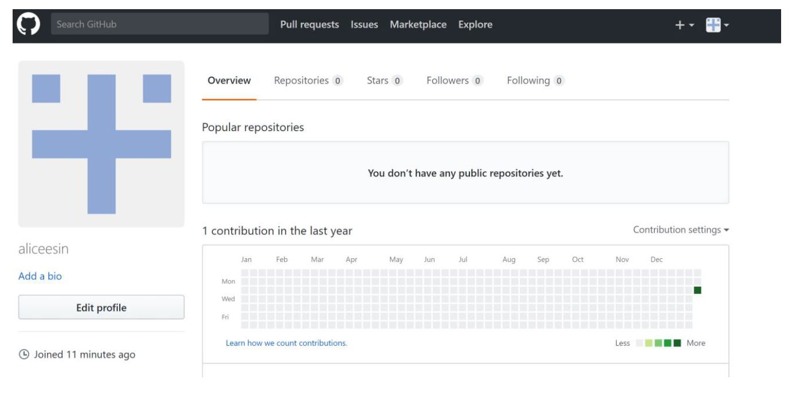

# Module 01

## Data science Friday  
DS Friday Assignments are in a separate .Rmd file under Data_Science_Fridays.Rmd 

### Installation check





### Portfolio repo setup
```
git add .
git commit -m "input message"
git push
```

## Origins and Earth Systems
### Evidence Worksheet_01 "Prokaryotes: The Unseen Majority"

[Whitman *et al* 1998](https://www.ncbi.nlm.nih.gov/pmc/articles/PMC33863/)

#### Learning objectives
Describe the numerical abundance of microbial life in relation to ecology and biogeochemistry of Earth systems. 

#### General questions
What were the main questions being asked?

- How many prokaryotes are there on Earth?  
- What is the abundance and location of microbes on Earth?  
- What is the carbon content of prokaryotes inhabited in different areas?  

What were the primary methodological approaches used?

- Large assumptions were made with a small sample size to estimate numbers for the entire Earth and especially for subsurface  
- Used average cell density to determine prokaryotes in the open ocean  
- Estimation using Gold: average porosity of the terrestrial surface is 3% and then assumed how much pore space each prokaryote will occupy  
-     Estimation of carbon content by using number of cells in open ocean, cells, and subsurface 

Summarize the main results or findings

-	Prokaryotes are found in the open ocean, soil, oceanic and terrestrial subsurfaces  
-	Most of the prokaryotes on Earth’s biosphere are found in the subsurface but it is hard to calculate a precise number  
-	Prokaryotes are also found in other habitats such as animals, leaves, and air but the content is much lower and the impact of the total number of prokaryotes a lot less  
-	Prokaryotes are a large reservoir for essential nutrients such as nitrogen, carbon, phosphorus
-	60-100% of the carbon on earth is from prokaryotes  
-	Prokaryotes contain 10 times more nitrogen and phosphorus than plants  
-	Highest prokaryotes in air is 60-70m in the air  
-	A large amounts of autotrophs are situated above 200m and are likely to provide energy for those at lower trophic levels  
- Mutations and rare genetic events are more likely to occur in the ocean and will use a higher amount of carbon as the higher turnover rate means the more mutations occur. This leads to a greater genetic diversity and ultimately the formation of a novel species that generates new pathways that helps form the global environment. 

Do new questions arise from the results?   

-	How do we distinguish between species of prokaryotes if there are so many genetic modifications?
-	What needs to be taken into account to distinguish prokaryotes and eukaryotes when prokaryotes have such a high turnover rate?  
-	What is the exact composition of each individual microbe?
-	The paper is from 1998 so are the numbers still accurate? How much has changed since then?   
- Is there better technology out there to make these calculations? Or would we still use cell density/porosity, etc?  


Were there any specific challenges or advantages in understanding the paper (*e.g.* did the authors provide sufficient background information to understand experimental logic, were methods explained adequately, were any specific assumptions made, were conclusions justified based on the evidence, were the figures or tables useful and easy to understand)?

-	Estimation/assumptions aren’t explained thoroughly  
-	Don’t show the actual calculations made so it is harder to believe  
-	Don’t know the amount of error in their calculations as they only give a single number
- What is the uncertainty?  

### Evidence Worksheet_02 “Life and the Evolution of Earth’s Atmosphere”

[Kasting and Siefert 2003](https://www.ncbi.nlm.nih.gov/pubmed/12004117)

#### Learning objectives: 

* Comment on the emergence of microbial life and the evolution of Earth systems
    
    
* Indicate the key events in the evolution of Earth systems at each approximate moment in the time series. If times need to be adjusted or added to the timeline to fully account for the development of Earth systems, please do so. 

    + 4.6 billion years ago   - Solar System Formation via the Supernova Explosion
    
    + 4.2 billion years ago   - Meteorite bombardment halted; Life was habitable
    
    + 3.8 billion years ago  - Existence of Life
    
    + 3.75 billion years ago  - LHB meteorites; formation of Archaea 
    
    + 3.5 billion years ago - Microfossils and stromalites are present; Rubisco might have been developed around this time
    
    + 3.0 billion years ago  - Cyanobacteria photosynthesize
    
    + 2.7 billion years ago  - Origins of Eukarya; Great Oxidation event 
    
    + 2.2 billion years ago  - Glaciation Event and the Rise of O2
    
    + 2.1 billion years ago  - Existence of Eukaryotes
    
    + 1.3 billion years ago  - Complex Eukaryotes; multicellular life 
    
    + 550,000 years ago - Cambrian Explosion; first land plants
    
    + 200,000 years ago - Gigantism of organisms


* Describe the dominant physical and chemical characteristics of Earth systems at the following waypoints:  

    + Hadean  
    High CO2 levels  
    Sun was not as hot
    Earth was molten rock and very hot 
    
    + Archean  
    Atmosphere had CH4 to keep Earth warm  
    Some O2 present  
    CO2 levels still high  
    
    + Precambrian  
    High atmospheric O2
    
    + Proterozoic  
    O2 and CH4 reacted to produce CO2
    There was a glaciation event
    
    + Phanerozoic  
    High atmospheric O2
    Coal deposits from organisms that died from extinction 

### Evidence Worksheet_03 "The Anthropocene"

[Rockstrom *et al* 2009](https://www.nature.com/articles/461472a)

#### Learning Objectives
Evaluate human impacts on the ecology and biogeochemistry of Earth systems.


#### General Questions

What were the main questions being asked?

-	Which Earth-system processes thresholds, when crossed could generate unaccceptable environmental changes?  
-	Which Earth-system processes have already crossed the safe threshold for the Earth system to function?   

What were the primary methodological approaches used?  

-	Proposed a framework based on “planetary boundaries” that define the safe operating space for humanity 
-	To generate the threshold for most of the systems, the authors used a control variable if it was possible although some of them are more difficult  

Summarize the main results or findings. 

-	There are 9 processes that are necessary to define planetary boundaries: climate change, rate of biodiversity loss, interference with the nitrogen and phosphorous cycles, stratospheric ozone depletion, ocean acidification, global fresh water use, change in land use, chemical pollution, and atmospheric aerosol landing 
-	Humanity is approaching the boundary for global freshwater use, change in land use, ocean acidification and interference with the global phosphorus cycle
-	Climate change, rate of biodiversity loss and interference with the nitrogen cycle have already passed their proposed boundaries 
-	Earth cannot sustain the current loss of biodiversity without any significant erosion of ecosystem resilience 
-	As the boundary of one process is transgressed, then the other boundaries are also under serious risk 
-	Earth’s subsystems are moving outside of the stable Holocene state and may be moving into a new Anthropocene state

Do new questions arise from the results?

-	As the authors have mentioned, all the systems are interlinked. So, if the threshold of one is passed, the others are affected as well. But there lacks solid understanding of the implications of the other systems when one boundary has been exceeded
-	How long will it take to cause dangerous environmental changes? 
-	Is it possible to return the Earth’s systems to safe levels? 

Were there any specific challenges or advantages in understanding the paper (e.g. did the authors provide sufficient background information to understand experimental logic, were methods explained adequately, were any specific assumptions made, were conclusions justified based on the evidence, were the figures or tables useful and easy to understand)?

-	I particularly enjoyed the figures and tables in this paper as it made the data much easier to understand 
-	The figures in particular were a great visual to show how we are reaching or may have passed the threshold for certain processes 
-	The methods as to how they derived the numbers were not explained in detail, however it appears that it can be found in ref 10. 


### Problem set_01 "Prokaryotes: The Unseen Majority"

[Whitman *et al* 1998](https://www.ncbi.nlm.nih.gov/pmc/articles/PMC33863/)

#### Learning objectives: 
Describe the numerical abundance of microbial life in relation to the ecology and biogeochemistry of Earth systems.

#### Specific questions:
**What are the primary prokaryotic habitats on Earth and how do they vary with respect to their capacity to support life? Provide a breakdown of total cell abundance for each primary habitat from the tables provided in the text.**  

Aquatic = 1.16 x 10^24^ cells  
Soil = 2.556 x10^24^ cells   
Oceanic subsurface = 3.5 x 10^30^ cells   
Terrestrial subsurface = 0.25 - 2.5x10^30^ cells  
Total subsurface = 3.8 x 10^30^ cells  


**What is the estimated prokaryotic cell abundance in the upper 200 m of the ocean and what fraction of this biomass is represented by marine cyanobacterium including Prochlorococcus? What is the significance of this ratio with respect to carbon cycling in the ocean and the atmospheric composition of the Earth?**  

3.6x10^28^ cells in the upper 200m of the ocean  
2.9x 10^27^ cells are autotrophs  
Upper 200m autotrophs: 5x10^5^/mL mostly Prochlorococcus (avg density 10*10^4^/mL) which is about 8% of the biomass so that means carbon is available for 92% of heterotrophs

This ratio shows that a majority of the carbon cycling or fixation occurs in the ocean and that these autotrophs are important players in control of the atmospheric composition of the Earth.  


**What is the difference between an autotroph, heterotroph, and a lithotroph based on information provided in the text?** 

Autotroph – sustains itself using light energy found on surface of the ocean and is “self-nourishing". It can fix inorganic carbon into biomass.   

Heterotroph – it uses organic matter to produce energy  

Lithotroph – it uses inorganic substrates to produce energy  

**Based on information provided in the text and your knowledge of geography what is the deepest habitat capable of supporting prokaryotic life? What is the primary limiting factor at this depth?**  

Life exists until the terrestrial subsurface (3-4km). The deepest point in the ocean is Mariana's Trench (10.9km deep) so the lowest point of life could exist at 14.9km deep. The limiting factor is the temperature (125 degrees Celsius).

**Based on information provided in the text your knowledge of geography what is the highest habitat capable of supporting prokaryotic life? What is the primary limiting factor at this height?**  

Highest habitat: Mount Everest (8.8km above sea level)  
The primary limiting factors: lack of nutrients, lack of moisture, and high amounts of ionizing radiation.

**Based on estimates of prokaryotic habitat limitation, what is the vertical distance of the Earth’s biosphere measured in km?**  
Top of Mount Everest (8.8km) + Mariana's Trench (10.9km) + ground surface (4km) = 24km vertical distance 

**How was annual cellular production of prokaryotes described in Table 7 column four determined? (Provide an example of the calculation)**  

```
population size * turnover/year = cells/year
```
Sample calculation
```
3.6*10^28 * 365days/16days = 8.8*10^24
```


**What is the relationship between carbon content, carbon assimilation efficiency and turnover rates in the upper 200m of the ocean? Why does this vary with depth in the ocean and between terrestrial and marine habitats?**  

Author: assumption that carbon efficiency = 20%  
Assuming that it is 20fg of C/prokaryotic cell = 20^-30^ petagrams  

The amount of carbon in marine heterotrophs (Pg/cell) = 3.6x10^28^ * 20^-30^Pg of C/cell  
The amount of carbon in marine heterotrophs = 0.72  
If we use a 4 multiplier:  
4 x 0.72 = 2.88 pg of C/year  

This will vary with depth in the ocean and terrestrial and marine habitats because the amount of carbon consumed will also vary depending on location and so will the microbial relationships in the population or amongst populations. 


**How were the frequency numbers for four simultaneous mutations in shared genes determined for marine heterotrophs and marine autotrophs given an average mutation rate of 4 x 10^-7^ per DNA replication? (Provide an example of the calculation with units. Hint: cell and generation cancel out)**   


4x10^-7^ mutations per DNA replication  
Want 4 of them to happen at once = 4x10^-7^ * 10^-4^ = 2.56x10^-26^  
3.6x10^28^ cells * 365/16 days = 22.8 turnovers per year  
6.8x10^24^ cels * 22.8 = 8.2 x 10^29^ cells / year  
8.2x10^29^ cells/year * 2.56x10^26^   mutations/generation = 2.1 x 10^4^ mutations per year
If we convert to h per mutations: 0.4h/ point mutation 


**Given the large population size and high mutation rate of prokaryotic cells, what are the implications with respect to genetic diversity and adaptive potential? Are point mutations the only way in which microbial genomes diversify and adapt?**   

The high mutation rate increases both the genetic diversity and adaptive potential of prokaryotes. The increased mutations means that there is a higher chance that there is an advantageous mutation to form a novel species. 

Mutations can be gained through plasmids (horizontal gene transfer), recombination, external mutagens and other methods, not just point mutations. 

**What relationships can be inferred between prokaryotic abundance, diversity, and metabolic potential based on the information provided in the text?**  

The abundance of prokaryotes and its rapid replication leads to a high mutation rate. This increases its diversity in a population, which in turn increases the metabolic potential. Its increase in metabolic potential may have other implications such as the creation of new metabolic niches unique to a specific ecotype. 

    
### Problem set_02 “Microbial Engines”

[Falkowski *et al* 2008](https://www.ncbi.nlm.nih.gov/pubmed/18497287)

#### Learning objectives: 
Discuss the role of microbial diversity and formation of coupled metabolism in driving global biogeochemical cycles.

#### Specific Questions:
**What are the primary geophysical and biogeochemical processes that create and sustain conditions for life on Earth? How do abiotic versus biotic processes vary with respect to matter and energy transformation and how are they interconnected?**  

Geophysical: Tectonic plates and atmospheric photochemical processes supply substrates to move products. These two processes allow elements and molecules to interact with each other to form and break bonds in a cycle. 


Biogeochemical: Mostly abiotically driven acid-base reactions and biologically driven redox reactions. The biogeochemical macromolecules that play a large role are H, C, N, O, S, and P. Rock weathering also drives the nutrient cycles on Earth, as it can remove CO2 and allow cellular respiration to occur. 


Abiotic processes typically use acid-base chemistry to set lower limits on external energy needed to sustain the biogeochemical cycles. It creates biogeochemical cycles at the planetary and geological time scales. In contrast, biotic processes use redox reactions and the six major macromolecules to create the average redox condition of the oceans and atmosphere. 

**Why is Earth’s redox state considered an emergent property?**  

The evolution of microbial metabolic and geochemical processes create redox conditions on Earth. All the processes are linked and interconnected. 
  

**How do reversible electron transfer reactions give rise to element and nutrient cycles at different ecological scales? What strategies do microbes use to overcome thermodynamic barriers to reversible electron flow?**  

The cycles can be oxidative or reductive and can feed into new reactions to create cycles. Element and nutrient cycles arise via the reversible electron transfer. When the hydrogen tension is low, the reverse process then becomes more favourable. To overcome the thermodynamic barriers of reversible electron flow, different species of microbes come together to pool their synergistic flow.

**Using information provided in the text, describe how the nitrogen cycle partitions between different redox “niches” and microbial groups. Is there a relationship between the nitrogen cycle and climate change?**  

In order for nitrogen to become accessible, N2 has to be converted to NH4+. However, nitrogenase cannot be used under aerobic conditions. This results in the partitioning of multiple microbial groups with different redox "niches". Ammonium gets converted to nitrite by Bacteria and Archaea first. Nitrite then gets converted to nitrate by chemoautotrophs. Finally, opportunistic microbes use nitrite and nitrate as electron acceptors and as a result, N2 can be used and closes the N-cycle.

There is a relationship between the nitrogen cycle and climate change. Climate change affects the level of sunlight available for the opportunistic microbes can use for photosynthesis. This affects the amount of nitrogen-fixation because it uses nitrite and nitrate as terminal electron acceptors. The nitrogen cycle also influences climate change because the nitryfing organisms may use NH4+ to reduce CO2 into organic matter, thereby reducing the greenhouse effect. 


**What is the relationship between microbial diversity and metabolic diversity and how does this relate to the discovery of new protein families from microbial community genomes?**

There is low metabolic diversity in essential multimeric microbial machines despite the fact that they may be operating sub-optimally. This results in the generation of complicated repair cycles in which new proteins may be created to repair and/or replace the sub-optimally performing protein. This conservation of essential metabolic pathways can result in new protein families arising.  

**On what basis do the authors consider microbes the guardians of metabolism?**  

The authors consider microbes the guardians of metabolism because microbes are able to protect the metabolic pathway while under environmental selection or strong environmental perturbations. In the occasion that a taxonomic unit undergoes extinction, there will be another unit that contains the genetic information necessary to keep the metabolic cycle alive. 

### Writing assessment_01: "Microbial Engines and Humans"

Where the final goal is to keep the human species alive, I believe that it is both vital and necessary for microbes stay alive and continue to contribute to the global catalysis. Throughout history, time and time again, microbes have shown us that they are resilient and are able to persist through tough environmental conditions and selective pressures. The current rapid changes to our environment allude to the introduction of a new epoch on Earth. As such, it would be beneficial to have microbes that are well-equipped to overcome drastic changes in the environment, to be on our side and to work together with us. It is true that technological advances have brought us very far and has revealed a lot about how microbes function, but there is still a gap in knowledge that prevents us from replicating their exact pathway, leading to our dependency on them. Microbial life can easily live with us; however, we cannot survive without the global catalysis and environmental transformations it provides. 

The resiliency of microbes during extreme environmental changes ensures its own survival whereas human beings are unable to withstand similar pressures. It is believed that a new epoch called the Anthropocene, in which humans have become the main driver of global environment change has descended upon us and that we have left the much more stable Holocene epoch where humans thrived and civilizations arose (1, 2). It is believed that the Anthropocene was initiated at the beginning of the Industrial Revolution in which agriculture and industrialization grew at accelerating rates (1). The advancement of technologies during the industrial revolution has resulted in such a large-scale human impact on the environment that the landscape has immeasurably changed; this is evident through the nitrate levels of Greenland ice that have spiked to unseen levels in the last 100,000 years as a result of nitrogen for agricultural use (1). In addition, sediments and nonglacial organic matter have been found to contain plastics, radionuclides, pesticides, and metals while greenhouse gases have increased to unprecedented levels, clearly drawing a distinction from the Holocene epoch (1). It is important to note that had humans not pressurized the environment through fossil fuels and agriculture, the stable Holocene was expected to continue for another several thousand years (2).

The rapidly changing environment has lead to the global warming of temperatures and the continuous increase can only lead to irreversible climate change. A boundary for climate change was calculated and proposed based on the atmospheric concentration of carbon dioxide and radiative forcing (the amount of energy produced per unit area of the globe) (2). According to Rockstrom et al., our current Earth has already breached his proposed boundary numbers and can lead to real risks of irreversible climate change. The retreating Arctic polar sheets and the rising sea levels only act as further evidence that the Earth is now a part of a warmer era, one that is outside of the stable Holocene (2). But these drastic environmental changes are only alarming to humans as they are nothing new to many microbes, especially those that have been around since the Archean era, around 2.4 billion years ago (3). An example of such is Cyanobacteria, which can still be found in our current ocean waters. It has survived through multiple glaciation events and multiple epochs with varying climates throughout time. If it is true that we are heading into irreversible climate change, then microbes will be an invaluable ally and resource as humans attempt to battle such drastic changes (2, 3).

A factor that plays into the microbes’ resilient nature to changing environments is the horizontal gene flow through much of its early cellular evolution. Entire metabolic pathways, including those that are essential to the biogeochemical cycle can be horizontally transferred to other species that are typically responsible for other functions (4). Horizontal gene transfer is powerful in that it allows metabolic pathways to be conserved over time in the occasion that a taxonomic unit with an essential pathway undergoes extinction due to natural disaster or extreme environmental changes (4). The environmental selection pressures can also lead to evolution of boutique, or accessory genes that protect essential metabolic pathways (4). Because of the importance of a certain pathways, even sub-optimally functioning pathways will be kept with minimal changes. Instead, new proteins will be generated or other mechanisms will be developed to support the use of the pathway. An example of this is the protein nitrogenase, one of the most important proteins for nitrogen-fixation that can only function in aerobic environments (4). The caveat is that most nitrogen-fixing microbes live in aerobic environments. Therefore, to maintain the use of nitrogenase, organisms have protected the enzyme by only fixing nitrogen in anaerobic environments (4). This shows that microbes will make adaptations depending on which pathways are essential. Both horizontal gene transfer and the role microbes play in protecting essential metabolic pathways is evidence for microbes being able to overcome great selective pressures (4). 

The ability for multiple species of microbes to contribute to a larger pathway is also an advantage that gives microbes the edge over humans (4). One example is nitrogen-fixation in which there are multiple microbes that are spatially segregated working together (4). Because nitrogenase is only able to function in anaerobic environments, nitrogen-fixation was split down into parts where ammonia gets initially oxidized by certain Archaea or Bacteria to nitrite and then from nitrite to nitrate by chemoautotrophic microbes, and finally, opportunistic microbes will use nitrate as electron acceptors to produce N2 (4). Multiple species of microbes working together and combining multiple pathways to reach an end product is a process that is difficult to replicate by humans due to the lack of knowledge about microbial structures and all the pathways and proteins used (4). Although technology has advanced enough that we are able to use metagenomics to sequence the full genomes of microbes, there is still not enough information for us to fully replicate what microbes do which ultimately leads to our dependency on microbes (4). As such, we cannot live without microbes, but perhaps, as we become more knowledgeable through time, opportunities to use the technology we have discovered will arise to aid us in working together with them to create a planet that is continuously habitable in the future, despite us having possibly left the more stable Holocene epoch (2). 

The global catalysis and the biogeochemical cycles of microbes are important to humans. Their resiliency through environmental extremes is reflected throughout history and is indicative of their capability to adapt to the current changes we are experiencing. Their ability to retain essential metabolic pathways through many generations and use of multiple microbial species to carry out specific pathways is something that humans are currently unable to replicate as there is insufficient information (4). There is lots of uncertainty in the future as it is hard to predict where our rapidly changing environment will take us in the future. Integrating our technological advancements in conjunction with what microbes are already doing may be a step in the forward direction as the Earth continues to change. 

**References**

1. Waters, C. N., Zalasiewicz, J., Summerhayes, C., Barnosky, A. D., Poirier, C., Gałuszka, A., . . . Wolfe, A. P. (2016). The anthropocene is functionally and stratigraphically distinct from the holocene. Science (New York, N.Y.), 351(6269), aad2622-aad2622. 10.1126/science.aad2622
2. Rockström, J., Steffen, W., Noone, K., Scheffer, M., Teknik- och vetenskapshistoria (bytt namn 20120201), Skolan för arkitektur och samhällsbyggnad (ABE), . . . Filosofi och teknikhistoria. (2009). A safe operating space for humanity. Nature, 461(7263), 472-475. 10.1038/461472a
3. Nisbet, E. G., & Sleep, N. H. (2001). The habitat and nature of early life. Nature, 409(6823), 1083-1091. 10.1038/35059210
4. Falkowski, P. G., Fenchel, T., & Delong, E. F. (2008). The microbial engines that drive earth's biogeochemical cycles. Science, 320(5879), 1034-1039. 10.1126/science.1153213


### Module 01 references

Falkowski PG, Fenchel T, Delong EF. The Microbial Engines That Drive Earth’s Biogeochemical Cycles. Science. 2008 May 23;320(5879):1034–9. [PMID18497287](https://www.ncbi.nlm.nih.gov/pubmed/18497287)

Rockström J, Steffen W, Noone K, Persson Å, Iii FSC, Lambin EF, et al. A safe operating space for humanity. Nature. 2009 [Link](https://www.nature.com/articles/461472a)

Whitman WB, Coleman DC, and Wiebe WJ. 1998. Prokaryotes: The unseen majority. Proc Natl Acad Sci USA. 95(12):6578–6583.  [PMC33863](https://www.ncbi.nlm.nih.gov/pmc/articles/PMC33863/)

# Module 02

### Evidence Worksheet_04 “Bacterial Rhodopsin Gene Expression”

[Martinez *et al* 2007](https://www.ncbi.nlm.nih.gov/pmc/articles/PMC1838496/)

#### Learning objectives:

- Discuss the relationship between microbial community structure and metabolic diversity
- Evaluate common methods for studying the diversity of microbial communities
- Recognize basic design elements in metagenomic workflows

#### General Questions

What were the main questions asked?

-	What are the functions and physiological roles of marine microbial photorhodopsin? 
-	Why is the PR system so ubiquitous? 
-	What is the function of the photosystem and opsin biosynthetic pathway gene products?

What were the primary methodological approaches used?

-	Screened large-insert DNA libraries derived from picoplankton for visibly detectable PR-expressing phenotypes
-	The fosmid clones were then sequenced and annotated
-	HPLC analysis was used to identify the pigments present

What were the primary methodological approaches used?

-	Screened large-insert DNA libraries derived from picoplankton for visibly detectable PR-expressing phenotypes
-	The fosmid clones were then sequenced and annotated
-	HPLC analysis was used to identify the pigments present

Summarize the main results or findings. 

-	Intact PR-based photosystems can be functionally expressed in E. Coli without addition of exogenous photopigment 
-	Functional screening approach is useful for identifying specific activities or phenotypes without any sequence information available 
-	Only six genes are needed to enable light-activated proton translocation and photophosphorylation 
-	Only a single horizontal transfer event is needed for a PR system to be introduced into an organism which ultimately explains the high prevalence of PR systems 

Do new questions arise from the results?

-	What is the prevalence of PR systems in other microorganisms outside of E. Coli? 
-	Just how widespread is this prevalence?
-	Is there a reason as to why there is a greater prevalence of PR systems amongst marine microorganisms? 

Were there any specific challenges or advantages in understanding the paper (e.g. did the authors provide sufficient background information to understand experimental logic, were methods explained adequately, were any specific assumptions made, were conclusions justified based on the evidence, were the figures or tables useful and easy to understand)? 

-	I thought the figures were easy to read but the methods section was a little lacking as there could be a greater explanation on the reason as to why specific assays or methods were chosen. 


### Problem set_03 “Metagenomics: Genomic Analysis of Microbial Communities”
#### Learning objectives: 
Specific emphasis should be placed on the process used to find the answer. Be as comprehensive as possible e.g. provide URLs for web sources, literature citations, etc.  

#### Specific Questions:
* How many prokaryotic divisions have been described and how many have no cultured representatives (microbial dark matter)?

    - 98 bacterial phyla
    - 20 archael phyla 
    - information is gathered from small 16S rRNA databases (sequence information)
    - but there could be up to 1500 bacterial phyla because there are microbes that live in the shadow biosphere 
    
[Rappé and Giovannoni 2003](https://www.annualreviews.org/doi/abs/10.1146/annurev.micro.57.030502.090759?rfr_dat=cr_pub%3Dpubmed&url_ver=Z39.88-2003&rfr_id=ori%3Arid%3Acrossref.org&journalCode=micro&), [Solden *et al* 2016](https://www.sciencedirect.com/science/article/pii/S1369527416300558), [Youssef *et al* 2015](https://www.ncbi.nlm.nih.gov/pmc/articles/PMC4522544/)

* How many metagenome sequencing projects are currently available in the public domain and what types of environments are they sourced from?

    - 110 000 on EBI database but it is always changing
    - Environments: ALL
        - sediments, soil, gut, aquatic
        - especially places where it's hard to culture communities

* What types of on-line resources are available for warehousing and/or analyzing environmental sequence information (provide names, URLS and applications)?  

    - Warehousing sequence information: [IMG/M](http://img.jgi.doe.gov/m), [MG-RAST](https://metagenomics.anl.gov/) (also does processing), [NCBI](https://www.ncbi.nlm.nih.gov/) (databases you can search that feed into other pipelines)
    - Biodiversity analysis: [EstimateS](http://viceroy.eeb.uconn.edu/estimates/)
    - Microbial biodiversity analysis: [MOTHUR](https://www.mothur.org/), [QIIME2](https://qiime2.org/)
    - Binning sequences: [MEGAN](http://www-ab.informatik.uni-tuebingen.de/software/megan ), CARMA  
        - use it to build a phylogenetic tree 
    
    Shotgun metagenomics
    - Analysing sequence data: [FASTQC](https://www.bioinformatics.babraham.ac.uk/projects/fastqc/)   
    - Assembly - EULER
    - Binning - GCOM
    - Annotation - [KEGG](www.genome.jp/kegg/)
    - Analysis pipelines: [MEGAN5](http://www-ab.informatik.uni-tuebingen.de/software/megan )

    Marker Gene Metagenomics
    - Standalone software: OTUbase
    - Analysis pipelines: [SILVA](https://www.arb-silva.de/), [GreenGenes](greengenes.lbl.gov/)
    - Denoising: AmpliconNoise
    - Databases - Ribosomal Database Project (RDP)


* What is the difference between phylogenetic and functional gene anchors and how can they be used in metagenome analysis?   
    - Phylogenetic
        - vertical gene transfer 

* What is metagenomic sequence binning? What types of algorithmic approaches are used to produce sequence bins? What are some risks and opportunities associated with using sequence bins for metabolic reconstruction of uncultivated microorganisms?  

    - Metagenomics: grouping of sequences that form a single genome
    
    - Types of algorithms:
        1. Aligning sequences to databases
        2. Grouping sequences to each other based on DNA characteristics: GC content, codon usage
        
    - Risks:
        - incomplete coverage of genome sequences
        - contamination from different phylogeny 

* Is there an alternative to metagenomic shotgun sequencing that can be used to access the metabolic potential of uncultivated microorganisms? What are some risks and opportunities associated with this alternative?  

    - functional screens (ie. biochemical assays)
        - can make big librarys of DNA
    - 3rd generation sequencing (ie. Nanopore)
        - single molecule sequencing which is a good hybrid 
    - single cell sequencing 
    - FISH probe

### Module_02 References

Martinez A, Bradley AS, Waldbauer JR, Summons RE, DeLong EF. Proteorhodopsin photosystem gene expression enables photophosphorylation in a heterologous host. Proceedings of the National Academy of Sciences. 2007 Mar 27;104(13):5590–5. [PMC1838496](https://www.ncbi.nlm.nih.gov/pmc/articles/PMC1838496/)

Wooley JC, Godzik A, Friedberg I. A Primer on Metagenomics. Bourne PE, editor. PLoS Computational Biology. 2010 Feb 26;6(2):e1000667. [Link](http://dx.plos.org/10.1371/journal.pcbi.1000667)

# Module 03

### Evidence Worksheet_05 "Extensive Mosaic Structure"

[Welch *et al* 2002](http://www.pnas.org/content/99/26/17020)

#### Learning objectives:

- Evaluate the concept of microbial species based on environmental surveys and cultivation studies.
- Explain the relationship between microdiversity, genomic diversity and metabolic potential
- Comment on the forces mediating divergence and cohesion in natural microbial communities

What were the main questions being asked?

- How different is the genotype between different strains of E. coli? 
- What defines and marks a species within a genotype?

What were the primary methodological approaches used?

-	CFT073 strain was first isolated, cloned, and then whole genome sequenced using dye-terminator sequencing, primers and PCR-based techniques
-	Alignment was done using BLAST 
-	MAGPIE was used to annotate the ORFs for unique identifiers
-	Orthology was inferred when a CFT073 gene exceeded 90% identity and alignments included at least 90% of the genes in the MG1655 and EDL933 genomes and lacked an equivalent match in other locations of the CFT073 genome


Summarize the main results or findings. 

-	CFT073 genome is 590bp, which is 209 bp longer than the MG1655 strain
-	Backbone of all strains were conserved but there were certain sequences that would be inserted 
-	EDL933 backbone and CFT073 backbone were indistinguishable
    -	Genes that were shared were iron-uptake systems, potential fatty acid biosynthetic enzymes, adhesions, photophosferase system, ATP-binding cassette 
    -	Island locations and size were the same although the contents were unrelated
    -	Some islands were unique to a specific strain 
-	The backbone helped to mark the evolutionary history for pathogenic and non-pathogenic strains 
-	Common core chromosome has been preserved over time
 

Do new questions arise from the results?

-	How do we define a species?
-	Is everything classified under a single species despite them having different functions?

Were there any specific challenges or advantages in understanding the paper (e.g. did the authors provide sufficient background information to understand experimental logic, were methods explained adequately, were any specific assumptions made, were conclusions justified based on the evidence, were the figures or tables useful and easy to understand)? 

-	The authors explained the method in a way that made sense
-	The venn diagram was not only effective in showing how little overlap there is between the three strains of E. Coli but also showing the amount of similarity there is between each of them to each other  

#### Part 2 Learning objectives:

- Comment on the creative tension between gene loss, duplication and acquisition as it relates to microbial genome evolution
- Identify common molecular signatures used to infer genomic identity and cohesion
- Differentiate between mobile elements and different modes of gene transfer

Based on your reading and discussion notes, explain the meaning and content of the following figure derived from the comparative genomic analysis of three *E. coli* genomes by Welch et al. Remember that CFT073 is a uropathogenic strain and that EDL933 is an enterohemorrhagic strain. Explain how this study relates to your understanding of ecotype diversity. Provide a definition of ecotype in the context of the human body. Explain why certain subsets of genes in CFT073 provide adaptive traits under your ecological model and speculate on their mode of vertical descent or gene transfer.

- This figure shows the genomic backbone of the two strains of *E. Coli*. The vertical axis indicates the size of the island whereas the horizontal axis is the backbone. Ecotype diversity is when a specific strain in a species occupies a certain environment or niche and contains the genes for it to survive in said environment. Specific ecotypes will undergo selective pressure unique to the environment it is in and therefore, its genomic background may be different from a species that occupies a different environment. Also, if some genomic islands were acquired through horizontal gene transfer, it is possible that those genes are selected and kept, bringing about several ecotypes. 

- An example of ecotype in relation to the human body are these two E. Coli strains. These strains operate in different environments and different niches and thus have different genes and different levels of expression of those genes. For example, if the CFT073 (enterohemorrhagic) strain was found in the urinary tract, it may no longer be pathogenic as that is not it’s normal niche and may not contain the genes necessary to be pathogenic. Certain subsets of genes get selected for depending on the environment an organism is in and is therefore known as an acquired adaptive trait. For example, the type II general secretory pathway secretion for chitinase is found in the backbone region between *rpsJ* and *tufA* of the CFT073 strain but not in the EDL933 strain. 


### Problem set_04 “Fine-scale phylogenetic architecture”
#### Learning objectives: 

* Gain experience estimating diversity within a hypothetical microbial community


#### Outline:

In class Day 1:

1. Define and describe species within your group's "microbial" community.
2. Count and record individuals within your defined species groups.
3. Remix all species together to reform the original community.
4. Each person in your group takes a random sample of the community (*i.e.* devide up the candy).

Assignment:

5. Individually, complete a collection curve for your sample.
6. Calculate alpha-diversity based on your original total community and your individual sample.

In class Day 2:

7. Compare diversity between groups.

#### Part 1: Description and enumeration
Obtain a collection of "microbial" cells from "seawater". The cells were concentrated from different depth intervals by a marine microbiologist travelling along the Line-P transect in the northeast subarctic Pacific Ocean off the coast of Vancouver Island British Columbia. 

Sort out and identify different microbial "species" based on shared properties or traits. Record your data in this Rmarkdown using the example data as a guide.

Once you have defined your binning criteria, separate the cells using the sampling bags provided. These operational taxonomic units (OTUs) will be considered separate "species". This problem set is based on content available at [What is Biodiversity](http://cnx.org/content/m12179/latest/).

For example, load in the packages you will use.
```{r message=FALSE}
#To make tables
library(kableExtra)
library(knitr)
#To manipulate and plot data
library(tidyverse)
```

Then load in the data. You should use a similar format to record your community data.  
**Sample data**
```{r}
example_data1 = data.frame(
  number = c(1,2,3, 4, 5, 6, 7, 8, 9, 10, 11),
  name = c("M&Ms", "skittles", "spheres", "strings", "jolly ranchers", "kisses", "lego", "wine gummy", "octopi gummy", "watermelon gummy", "gummy bear"),
  characteristics = c("6 different colors; chocolate inside", "5 different colours; sugar inside", "3 different colours; hard sugar", "red", "5 different colours; hard sugar", "chocolate inside", "yellow", "2 different colours", "pink and yellow; 7 legs", "sugar covered", "6 colours"),
  occurences = c(48, 52, 4, 2, 45, 7, 1, 2, 1, 1, 16)
)
```

**Community data**
```{r}
community_data = data.frame(
  number = c(1,2,3, 4, 5, 6, 7, 8, 9, 10, 11, 12, 13, 14, 15),
  name = c("M&Ms", "skittles", "spheres", "strings", "jolly ranchers", "kisses", "lego", "wine gummy", "octopi gummy", "cola gummies","swirl peppermint candy", "gummy bear", "sugar coated gummy bears","cherry gummy", "watermelon gummy"),
  characteristics = c("6 different colors; chocolate inside", "5 different colours; sugar inside", "3 different colours; hard sugar", "red", "5 different colours; hard sugar", "chocolate inside", "yellow", "2 different colours", "pink and yellow; 7 legs", "sugar coated", "red or blue", "6 colours", "3 colours", "sugar coated", "sugar coated"),
  occurences = c(242, 197, 19, 14, 131, 16, 17, 8, 6, 3, 3, 101, 3, 1, 2)
)
```


Finally, use these data to create a table.
**Sample data**
```{r}
example_data1 %>% 
  kable("html") %>%
  kable_styling(bootstrap_options = "striped", font_size = 10, full_width = F)
```

**Community data**
```{r}
community_data %>% 
  kable("html") %>%
  kable_styling(bootstrap_options = "striped", font_size = 10, full_width = F)
```
For your community:

* Construct a table listing each species, its distinguishing characteristics, the name you have given it, and the number of occurrences of the species in the collection.
* Ask yourself if your collection of microbial cells from seawater represents the actual diversity of microorganisms inhabiting waters along the Line-P transect. Were the majority of different species sampled or were many missed? 

    - Sampling bias
    - Difference in samples originally
 
#### Part 2: Collector's curve
To help answer the questions raised in Part 1, you will conduct a simple but informative analysis that is a standard practice in biodiversity surveys. This analysis involves constructing a collector's curve that plots the cumulative number of species observed along the y-axis and the cumulative number of individuals classified along the x-axis. This curve is an increasing function with a slope that will decrease as more individuals are classified and as fewer species remain to be identified. If sampling stops while the curve is still rapidly increasing then this indicates that sampling is incomplete and many species remain undetected. Alternatively, if the slope of the curve reaches zero (flattens out), sampling is likely more than adequate.

To construct the curve for your samples, choose a cell within the collection at random. This will be your first data point, such that X = 1 and Y = 1. Next, move consistently in any direction to a new cell and record whether it is different from the first. In this step X = 2, but Y may remain 1 or change to 2 if the individual represents a new species. Repeat this process until you have proceeded through all cells in your collection.

For example, we load in these data.
```{r}
example_data2 = data.frame(
  x = c(1,2,3,4,5,6,7,8,9,10,11, 12, 13, 14, 15, 16, 17, 18, 19, 20, 21, 22, 23, 24, 25, 26, 27, 28, 29, 30, 31, 32, 33, 34, 35, 36, 37, 38, 39, 40, 41, 42,43,44,45,46,47,48,49,50,51,52,53,54,55,56,57,58,59,60,61,62,63,64,65,66,67,68,69,70,71,72,73,74,75,76,77,78,79,80,81,82,83,84,85,86,87,88,89,90,91,92,93,94,95,96,97,98,99,100,101,102,103,104,105,106,107,108,109,110,111,112,113,114,115,116,117,118,119,120,121,122,123,124,125,126,127,128,129,130,131,132,133,134,135,136,137,138,139,140,141,142,143,144,145,146,147,148,149,150,151,152,153,154,155,156,157,158,159,160,161,162,163,164,165,166,167,168,169,170,171,172,173,174,175,176,177,178,179),
  y = c(1,2,3,4,4,4,5,5,5,5,6,6,6,6,6,6,6,6,6,6,6,6,6,6,6,7,7,7,7,7,7,7,7,7,8,8,8,8,8,8,8,8,8,8,8,8,8,8,8,8,8,8,8,8,8,8,8,8,8, 8,8,8,8,8,8,8,8,8,8,8,8,8,8,8,8,8,8,8,8,8,8,8,8,8,8,8,8,8,8,8,8,8,8,8,8,9,9,9,9,9,9,9,9,9,9,9,9,9,9,9,9,9,9,10,10,10,10,10,10,10,10,10,10,10,10,11,11,11,11,11,11,11,11,11,11,11,11,11,11,11,11,11,11,11,11,11,11,11,11,11,11,11,11,11,11,11,11,11,11,11,11,11,11,11,11,11,11,11,11,11,11,11,11,11,11,11,11,11,11)

)
```

And then create a plot. We will use a scatterplot (geom_point) to plot the raw data and then add a smoother to see the overall trend of the data.
```{r}
ggplot(example_data2, aes(x=x, y=y)) +
  geom_point() +
  geom_smooth() +
  labs(x="Cumulative number of individuals classified", y="Cumulative number of species observed")
```

For your sample:

* Create a collector's curve for your sample (not the entire original community).
* Does the curve flatten out? If so, after how many individual cells have been collected?
    - The curve flattens out after about 150 individual cells have been collected but the slope also plateau's once in the middle of the graph at aboutr 55 individual cells.
* What can you conclude from the shape of your collector's curve as to your depth of sampling?  
    - The sample size is quite small so the graph produced is a little bit choppy. However, it does plateau at the end which shows that sampling is more than adequate and that there are not too many species missing. 

#### Part 3: Diversity estimates (alpha diversity)
Using the table from Part 1, calculate species diversity using the following indices or metrics.

##### Diversity: Simpson Reciprocal Index

$\frac{1}{D}$ where $D = \sum p_i^2$

$p_i$ = the fractional abundance of the $i^{th}$ species

For example, using the example data 1 with 3 species with 2, 4, and 1 individuals each, D =  

**Sample data**
```{r}
species1 = 48/(48+52+4+2+45+7+1+2+1+1+16)
species2 = 52/(48+52+4+2+45+7+1+2+1+1+16)
species3 = 4/(48+52+4+2+45+7+1+2+1+1+16)
species4 = 2/(48+52+4+2+45+7+1+2+1+1+16)
species5 = 45/(48+52+4+2+45+7+1+2+1+1+16)
species6 = 7/(48+52+4+2+45+7+1+2+1+1+16)
species7 = 1/(48+52+4+2+45+7+1+2+1+1+16)
species8 = 2/(48+52+4+2+45+7+1+2+1+1+16)
species9 = 1/(48+52+4+2+45+7+1+2+1+1+16)
species10 = 1/(48+52+4+2+45+7+1+2+1+1+16)
species11 = 16/(48+52+4+2+45+7+1+2+1+1+16)

1 / (species1^2 + species2^2 + species3^2+ species4^2+ species5^2+ species6^2+ species7^2+ species8^2+ species9^2+ species10^2+ species11^2)
```
**Community data**
```{r}
species1 = 242/806
species2 = 197/806
species3 = 19/806
species4 = 14/806
species5 = 131/806
species6 = 16/806
species7 = 17/806
species8 = 8/806
species9 = 6/806
species10 = 3/806
species11 = 3/806
species12 = 101/806
species13 = 3/806
species14 = 1/806
species15 = 2/806

1 / (species1^2 + species2^2 + species3^2+ species4^2+ species5^2+ species6^2+ species7^2+ species8^2+ species9^2+ species10^2+ species11^2+ species12^2+ species13^2+ species14^2+ species15^2)
```
The higher the value is, the greater the diversity. The maximum value is the number of species in the sample, which occurs when all species contain an equal number of individuals. Because the index reflects the number of species present (richness) and the relative proportions of each species with a community (evenness), this metric is a diveristy metric. Consider that a community can have the same number of species (equal richness) but manifest a skewed distribution in the proportion of each species (unequal evenness), which would result in different diveristy values.

* What is the Simpson Reciprocal Index for your sample? 4.350441
* What is the Simpson Reciprocal Index for your original total community? 5.15711

##### Richness: Chao1 richness estimator
Another way to calculate diversity is to estimate the number of species that are present in a sample based on the empirical data to give an upper boundary of the richness of a sample. Here, we use the Chao1 richness estimator. 

$S_{chao1} = S_{obs} + \frac{a^2}{2b})$

$S_{obs}$ = total number of species observed
a = species observed once
b = species observed twice or more

So for our previous example community of 3 species with 2, 4, and 1 individuals each, $S_{chao1}$ =  
**Sample data**
```{r}
11 + 3^2/(8*2)
```

**Community data**
```{r}
15 + 1^2/(14*2)
```
* What is the chao1 estimate for your sample? 11.5625
* What is the chao1 estimate for your original total community? 15.03846

#### Part 4: Alpha-diversity functions in R
We've been doing the above calculations by hand, which is a very good exercise to aid in understanding the math behind these estimates. Not surprisingly, these same calculations can be done with R functions. Since we just have a species table, we will use the `vegan` package. You will need to install this package if you have not done so previously. 

```{r message=FALSE}
library(vegan)
```

First, we must remove the unnecesary data columns and transpose the data so that `vegan` reads it as a species table with species as columns and rows as samples (of which you only have 1).  
**Sample data**
```{r}
example_data1_diversity = 
  example_data1 %>% 
  select(name, occurences) %>% 
  spread(name, occurences)

example_data1_diversity
```
Then we can calculate the Simpson Reciprocal Index using the `diversity` function.
```{r}
diversity(example_data1_diversity, index="invsimpson")
```
**Community data**
```{r}
community_diversity = 
  community_data %>% 
  select(name, occurences) %>% 
  spread(name, occurences)

community_diversity
diversity(community_diversity, index="invsimpson")
```


And we can calculate the Chao1 richness estimator (and others by default) with the the `specpool` function for extrapolated species richness. This function rounds to the nearest whole number so the value will be slightly different that what you've calculated above.  
```{r}
specpool(example_data1_diversity)
```
**Community data**
```{r}
specpool(community_diversity)
```
In Project 1, you will also see functions for calculating alpha-diversity in the `phyloseq` package since we will be working with data in that form.

For your sample:

* What are the Simpson Reciprocal Indices for your sample and community using the R function?
    - Sample: 4.350441
    - Community: 4.621526
* What are the chao1 estimates for your sample and community using the R function?
    - Sample: 11
    - Community: 15
    + Verify that these values match your previous calculations.

#### Part 5: Concluding activity
If you are stuck on some of these final questions, reading the [Kunin et al. 2010](https://www.ncbi.nlm.nih.gov/pubmed/19725865) and [Lundin et al. 2012](https://www.ncbi.nlm.nih.gov/pubmed/23760801) papers may provide helpful insights. 

* How does the measure of diversity depend on the definition of species in your samples?
    - The amount of diversity increases if there are more species. This is prevalent in the Simpson Reciprocal Indices I got for my sample in comparison to the community. Because there were only 11 species in my sample compared to the 13 in the total community, the Simpson Reciprocal number was lower in my sample. 
* Can you think of alternative ways to cluster or bin your data that might change the observed number of species?
    - I could further bin my data by separating each of these species by colour so that there could be a greater number of species. 
* How might different sequencing technologies influence observed diversity in a sample?
    - Some sequencing technologies may have higher error rates and may actually inflate the diversity estimate. However, this can be mediated by more stringent read quality filtering and lower clustering thresholds.
    
### Writing assessment_03: "The Microbial Species Definition"

The question as to what defines a species is brought to the forefront of debate in our current genomic era in which technology has advanced enough to allow us to discover more information on the extremely diverse microbes. Due to the different approaches and methods proposed to define a microbial species, the current definition is unclear and a consensus cannot be reached amongst various professionals (1). However, the addition of horizontal gene transfer (HGT) acts to only complicate matters more in our struggle to define a microbial species. 

The traditional use of taxonomy has allowed us to categorize an organism into a Phyla, Class, or other genera and as a result we could track the evolutionary changes the organism may have undergone. It was also possible to make inferences into its role in a larger biogeochemical cycle and its relationship with other organisms in a related environment. However, a pitfall is that when we try to compare the genomes of similar strains of an organism, such as E. Coli in which differentiation occurred millions of years ago, it becomes extremely difficult to pin point when specific genes were introduced, especially with HGT coming into play (1). 

With any changing environment there is a drive for HGT evolutionarily as organisms need to gain fitness to ensure their survival (2). With a single HGT event or the exchange of a genomic island, an entire metabolic pathway could be transferred from one organism to another. A direct implication of this is that microbes can much more quickly adapt to an entirely new and different environment (1). As it adapts and gains more point mutations, it may accrue so many changes that it may be vastly different from what it was a long time ago, thereby creating a new species, or a new strain that occupies a completely new niche. In addition, there may be multiple HGT events across time, from multiple organisms, resulting in high levels of variation within an individual species (1). However, it is these horizontal gene transfer events that result in the categorization of taxonomy to be much more difficult (2).

Currently, most of our classifications of microbes use next generation sequencing of the 16S rRNA conserved region. Because the 16S region has a hypervariable, conserved, and variable region, we are able to determine both its ancient lineage, the domain it belongs to, and its more modern lineage (3). This method has revealed a lot of information to us, including diversity for many microbes as we try to track the changes. However, 16S is still lacking in its resolution to differentiate between closely related species. In addition, if there are contributions to the genome from multiple related species, how does one define a single species?

With 16S rRNA sequencing, OTU-based methods and ASV-based methods are used to analyze the high-throughput data generated. OTU binning methods involve the clustering of sequences into OTU clusters via a 3% dissimilarity threshold typically. However, the current binning methods with OTUs do not give a clear enough resolution to the large amount of diversity within microbes and neither can it differentiate between very closely related species. In addition, the success in identifying an OTU cluster is largely dependent on the quality of the chosen reference database, resulting in varying results (4). 

The development of ASV derived methods in which there is a higher stringency produces a higher genetic resolution for 16S rRNA sequencing. Because ASVs can resolve sequences down to the nucleotide level, even single nucleotide differences can be detected. ASV methods also work independently of a reference database and thus, are not limited by it unlike OTU-derived methods (4). But overall, 16S identification still only takes into account a single region within the entire DNA and overlooks the changes that can occur through HGT outside of the 16S region. 
An alternative to the 16S rRNA approach includes multilocus sequence analysis (MLSA) in which the reconstruction of the phylogenetic tree is based housekeeping genes, as these genes are rarely horizontally transferred between organisms. It is typically accessory genes that get exchanged between species (2,5). For MLSA, typically five genes are suggested to overcome any noise, but numbers can vary depending on the robustness of the groups as those that are distantly related may need as many as twelve genes in conjunction with the use of filters to remove any phylogenetic noise. As such, MLSA produces a greater resolution in comparison to the 16S rRNA-based approach although some pitfalls include the need to create custom primers for each group of interest and the selection of arbitrary genes (5). The current lack of a single method that is completely able to differentiate a species with high enough definition shows that HGT proves to introduce many challenges. Nonetheless, moving forward with other approaches may better consider HGT events in the attempt to define a microbial species. 

Although HGT poses difficulty in creating a species definition that will completely define them, it also has positive consequences relating to the maintenance of our global biogeochemical cycles. The microbes’ ability to horizontally transfer genes to one another allows the Earth’s biogeochemical cycles to stay stable across time. For example, the important denitrification pathway contains various microbes of various populations working together to transform the initial substrate into the final product (6). Multiple species of in different populations can contain the same gene, but can also perform different tasks by controlling the level of expression of their genes. Even though microbes are dominant in different niches and perform different tasks typically, the overlap in genes means that if a certain species or population were to be wiped out, the denitrification cycle can still be carried on. This ensures that vital biogeochemical cycles, and in this case, denitrification, can still operate in the event of any natural disasters (6). 

As we continue to try and define microbes, we will find that our lack of knowledge about microbes and the constant changes they undergo will act as an obstacle. As we are only able to sequence about 10% of all the microbes on our planet, the unknown 90% can possibly play a large factor (7). Because we have yet to sequence them all, even if we were to be able to come up with a possible definition, it may not stick for the long term. As such, we may be going through our current dilemma continuously as we are gain more information on the microbial world. Microbes are biological units that can be both simple and very complex while simultaneously and constantly changing. It is possible that there may be no real “definition” that can properly explain their existence. Microbes’ genetic makeup is constantly changing in response to the environment around it that is concurrently changing. As we gain more information about them, we try harder to determine what defines a microbial species. However, this also results in us getting pulled into the complexity of their world before we realize that there may not be a “one size fits all” solution. Difficulties will arise when different professionals, such as an ecologist and a microbiologist try to work together without out a clear and concrete definition, but the information gained from further studies of microbes is nonetheless important as the sequencing of microbes have allowed us to make useful connections phenotypically, ecologically, and evolutionarily. And it just maybe true that the complexity of the microbe world prevents us from generating a single definition that will fit them all and continuously trying may be futile. 

Through the sequencing efforts of the 16S rRNA region, we have a constantly growing collection of data on microbes which has allowed us to peer a little more deeply not only into the interactions and relationships they have with other microbes but also the role they assume in the catalysis of our global biogeochemical cycles. However, the amount of information we have gained only scratches the surface of their world and HGT acts as a further obstacle in our attempts to define a microbial species due to the different origins of genetic data in organisms. However, microbes are biological units that are constantly changing with the environment and it may not be in our best interest to try and create a single definition as it may not be able to completely encapsulate their complexity. 

**References**

1. 	Achtman M, Wagner M. Microbial diversity and the genetic nature of microbial species. Nat Rev Microbiol. 2008 Jun;6(6):431–40. 
2. 	Pál C, Papp B, Lercher MJ. Adaptive evolution of bacterial metabolic networks by horizontal gene transfer. Nat Genet. 2005 Dec;37(12):1372–5. 
3. 	Yarza P, Yilmaz P, Pruesse E, Glöckner FO, Ludwig W, Schleifer K-H, et al. Uniting the classification of cultured and uncultured bacteria and archaea using 16S rRNA gene sequences. Nat Rev Microbiol. 2014 Sep;12(9):635–45. 
4. 	Callahan BJ, McMurdie PJ, Holmes SP. Exact sequence variants should replace operational taxonomic units in marker-gene data analysis. ISME J. 2017 Dec;11(12):2639–43. 
5. 	Rosselló-Móra R, Amann R. Past and future species definitions for Bacteria and Archaea. Syst Appl Microbiol. 2015 Jun 1;38(4):209–16. 
6. 	Falkowski PG, Fenchel T, Delong EF. The Microbial Engines That Drive Earth’s Biogeochemical Cycles. Science. 2008 May 23;320(5879):1034–9. 
7. 	Whitman WB, Coleman DC, Wiebe WJ. Prokaryotes: The unseen majority. Proc Natl Acad Sci. 1998 Jun 9;95(12):6578–83. 

### Project 1

See Project_1.pdf and Project_1_supplemental.rmd for the supplementary materials in the current directory. 
    
### Module_03 References

Callahan BJ. Exact sequence variants should replace operational taxonomic units in marker-gene data analysis. The ISME Journal. :5. [Link](https://www.ncbi.nlm.nih.gov/pubmed/28731476)

Hallam SJ, Torres-Beltrán M, Hawley AK. Monitoring microbial responses to ocean deoxygenation in a model oxygen minimum zone. Scientific Data. 2017 Oct 31;4:170158. [Link](http://www.nature.com/articles/sdata2017158)

Torres-Beltrán M, Hawley AK, Capelle D, Zaikova E, Walsh DA, Mueller A, et al. A compendium of geochemical information from the Saanich Inlet water column. Scientific Data. 2017 Oct 31;4:170159. [Link](http://www.nature.com/articles/sdata2017159)

Welch RA, Burland V, Plunkett G, Redford P, Roesch P, Rasko D, et al. Extensive mosaic structure revealed by the complete genome sequence of uropathogenic Escherichia coli. PNAS. 2002 Dec 24;99(26):17020–4. [Link](http://www.pnas.org/content/99/26/17020)

# Module 04

### Project 2

See Project_1.pdf and Project_1_supplemental.rmd for the supplementary materials in the current directory. 
